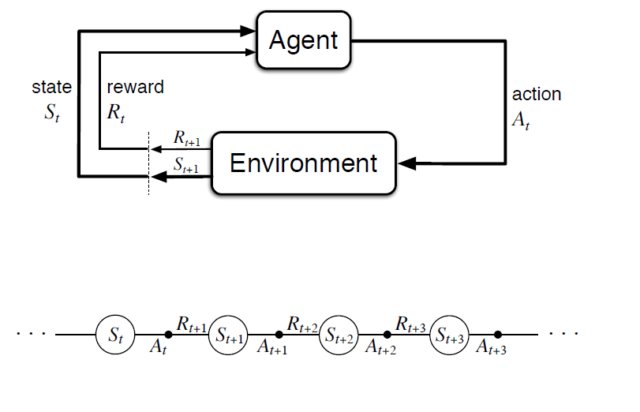

# Đặt vấn đề

Ở các bài toán tìm kiếm, trạng thái s, thực hiện hành động a nhất định sẽ dẫn đến hành động s'.
Ông bà ta có câu, người tính không bằng trời tính, hoặc là mưu sự tại nhân, thành sự tại thiên, tức là nếu ta thực hiện hành động a, không nhất định sẽ dẫn đến trạng thái s', mà sẽ là s'', s''' nào đó.

Ví dụ về các trường hợp (s,a) không ra s'

Vậy để giải quyết các bài toán có tính ngẫu nhiên, thì làm sao?

Có nhiều dạng bài toán mang tính ngẫu nhiên, nhưng hôm nay ta đến với một dạng bài toán hơi giống với bài toán tìm kiếm đã học.

Xét ví dụ về trò chơi ai là triệu phú phiên bản dùng để làm ví dụ, ở một câu hỏi sẽ có 4 câu trả lời, nếu dừng lại sẽ được 1 triệu ra về, nếu tiếp tục chơi, trả lời đúng sẽ nhận được 100 ngàn, sai thì ra về.

- Chiến thuật liều ăn nhiều -> kỳ vọng: 250.000 * (1 + 3/4 + 2*(3/4)^2 + 3*(3/4)^3 + ...) = 325.000

- Chiến thuật an toàn -> 1 triệu 

-> Nhìn vào thì ta sẽ thích chiến thuật an toàn hơn

Nhưng có chiến thuật nào khác để thu được phần thưởng nhiều nhất có thể không?

Trò chơi này được coi là một MDP (Markov Decision Process)

Và chiến thuật để thu được phần thưởng lớn nhất chính là đi tìm lời giải cho MDPs.

# Định nghĩa MDPs

## Mô hình MDPs

- __S__: Tập hợp các trạng thái có thể có 
- __A__: Tập hợp các hành động có thể thực hiện 
- __P(s, a, s')__: Xác xuất thực hiện hành động _a_ ở trạng thái _s_ dẫn đến trạng thái _s'_. Để ý tổng tích lũy tất cả các _P(s, a, s')_ với mọi _s'_ thuộc __S__ sẽ bằng 1.
- __R(s, a, s')__: Phần thưởng cho việc chuyển từ trạng thái _s_ sang trạng thái _s'_ sau khi thực hiện hành động _a_. Ở phần lớn các bài toán MDPs, cho đơn giản, nếu đến được trạng thái _s_, ta nhận được phần thưởng là _R(s)_
- Một trạng thái bắt đầu __*S0*__ và có thể có các trạng thái kết thúc.

## Markov

Trong MDPs, markov nghĩa là ở một trạng thái bất kỳ, ta đã có đủ thông tin để quyết định hành động tiếp theo mà không cần quan tâm đến các trạng thái ở quá khứ hay tương lai. 

Điều này giống ở các bài toán tìm kiếm đã học.

## So sánh với bài toán tìm kiếm

Ở bài toán tìm kiếm, một hành động ở một trạng thái chỉ có thể dẫn đến một trạng thái tiếp theo, và mục đích là tìm đường đến trạng thái đích với chi phí thấp nhất, vậy nếu, với mọi _s_, chỉ có một trạng thái _s'_ sao cho __P(s, a, s') = 1__, và __P(s, a, s'') = 0__ với mọi _s''_ khác _s'_. các phần thường __R(s, a, s')__ là dấu âm, và có một trạng thái kết thúc, thì tìm kiếm và MDPs lúc này tương đương.

# Giải MDPs

## Chiến lược (Policy)

Một lời giải của bài toán tìm kiếm chính là một đường đi, nhưng ở MDPs, một đường đi cố định là không khả thi, vì tính chất ngẫu nhiên của nó.

Do đó, một lời giải trong MDPs là một chiến thuật, mà ở bất kỳ trạng thái nào, chiến thuật ấy cho ta biết phải chọn hành động nào tiếp theo.

Vậy, một lời giải của một MDP, chính là một chiến lược __pi__, với __pi(s) = a__, nói cách khác, hàm __pi__ ánh xạ mỗi phần tử của tập trạng thái __S__ với một phần tử của tập hành động __A__

## Giá trị của một chiến lược (Value of a policy)

Có nhiều chiến lược, vậy chiến lược nào là tối ưu? Điều gì để so sánh giữa các chiến lược?

Tuân theo một chiến lược, ta sẽ được một đường đi ngẫu nhiên. 

Vậy, ta sẽ lấy giá trị kỳ vọng của một chiến lược, kí hiệu bởi: ... làm tiêu chuẩn so sánh giữa các chiến lược. Và gọi là giá trị của một chiến lược.

Cách tính giá trị của chiến lược này chưa nói đến, cần nói đến ở đây, giá trị một đường đi được quyết định như thế nào? Lấy giá trị đường đi là tổng tất cả các phần thưởng trên đường đi? Không khả thi, nếu bài toán không có trạng thái kết thúc, đường đi sẽ dài vô tận, và giá trị lúc đó là vô cùng, do đó giá trị các chiến lược cũng sẽ là vô cùng.

Người ta đặt giá trị của một đường đi [s0, s1, s2, ...] là tổng chiết khấu của tất cả các phần thưởng trên đường đi (discounted sum of rewards), tức là: ...
với 0 <= gamma <= 1. 

Dễ thấy: U <= Rmax * (1 + gamma + gamma^2 + ...) = Rmax/1-gamma, do đó giá trị của các chiến lược cũng sẽ không tiến đến vô cùng khi bài toán không có trạng thái kết thúc.

- Nếu gamma = 0, ta sẽ coi trọng phần thường ở trạng thái hiện tại hơn.
- Nếu gamma = 1, ta coi sự quan trọng giữa hiện tại và tương lai như nhau
- Nếu 0 < gamma < 1, phần thưởng càng xa hiện tại, ta càng ít coi trọng

## Giá trị của trạng thái (Value of a state)

Giả sử ta đang ở trạng thái _St = s_, và tuân theo chiến lược *__pi__*, như vậy, ta sẽ thu được giá trị kì vọng là *__U_pi(s)__*

Vậy, nếu tuân theo chiến lược tối ưu, ta sẽ phải tuân theo chiến lược nào mang đến giá trị kì vọng cao nhất.

Ký hiệu pi*_s là chiến lược tối ưu khi đang ở trạng thái _s_ vậy ta có: pi*_s = argmax U_pi(s)

Để ý rằng pi*_s cũng là một chiến lược, do đó nó cũng ánh xạ mỗi trạng thái với một hành động, liên hệ của nó với trạng thái s đơn giản chỉ là nó là một chiến lược tối ưu khi trạng thái bắt đầu là s.
 
Nếu pi*_a, pi*_b, pi*_c lần lượt là các chiến lược tối ưu bắt đầu ở a, b và c. Nếu ta tuân thủ theo pi*_a, pi*_b và cùng đến trạng thái c, lúc này pi*_a, pi*_b chẳng có lý do gì để đưa ra ý kiến khác pi*_c, vì mục đích của chúng đều là đạt được giá trị kỳ vọng lớn nhất tại c. Do đó, chiến lược tối ưu là độc lập với trạng thái bắt đầu, và ta gọi chung các chiến lược tối ưu là pi*. 

Khi đó, U_pi*(s) chính là giá trị kì vọng khi tuân theo chiến lược tối ưu pi* khi đang ở trạng thái s, và được gọi là gía trị của trạng thái s, viết gọn là U(s)

Lúc đó, pi*(s) = argmax_a sum_s' [P(s, a, s') * U(s')]

